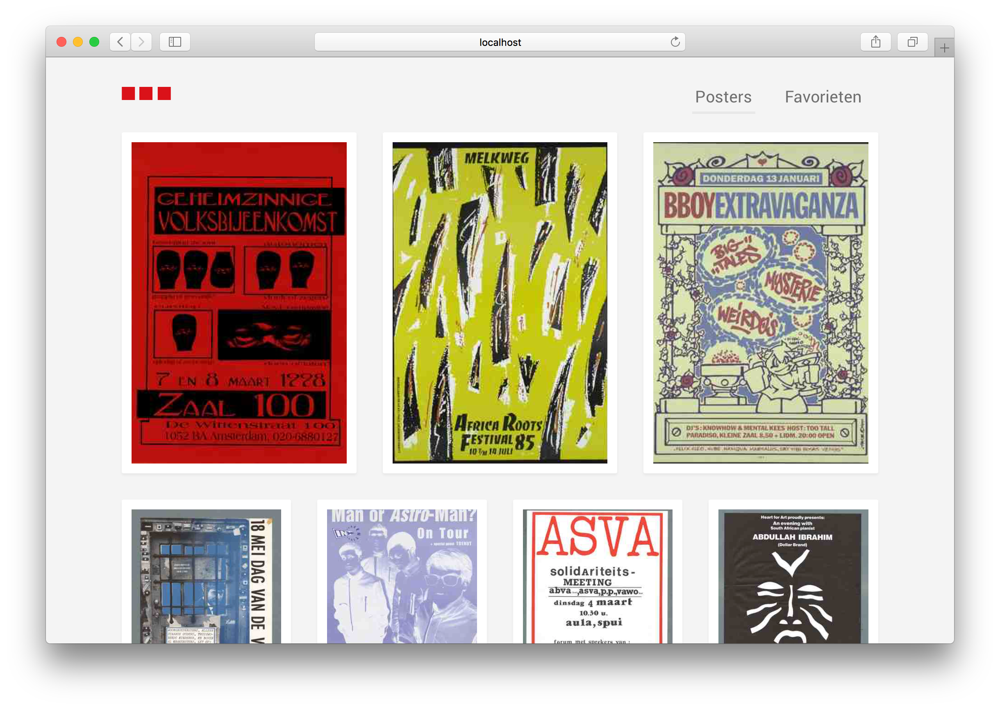
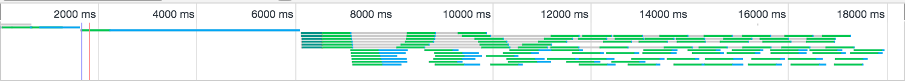
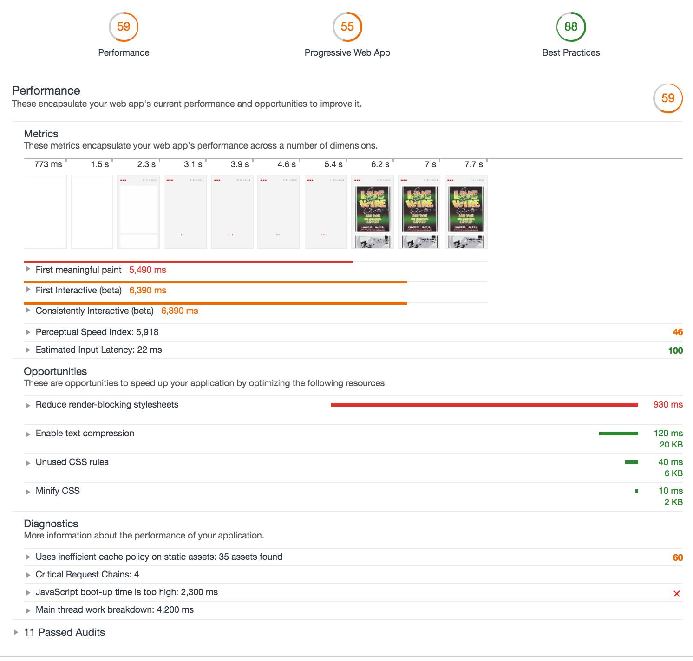
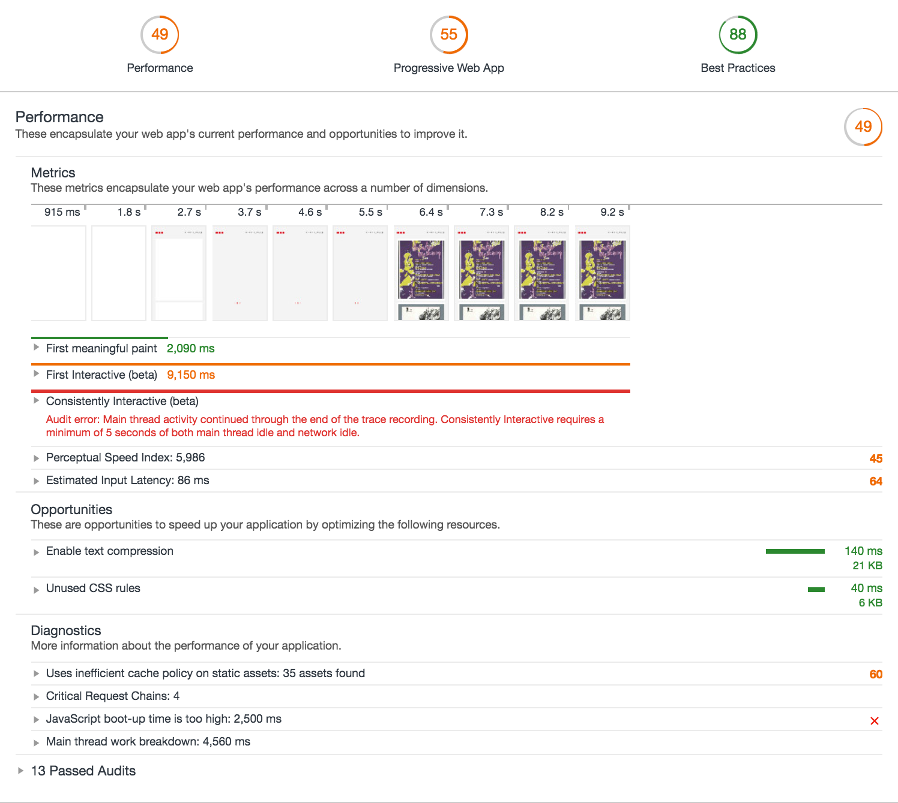
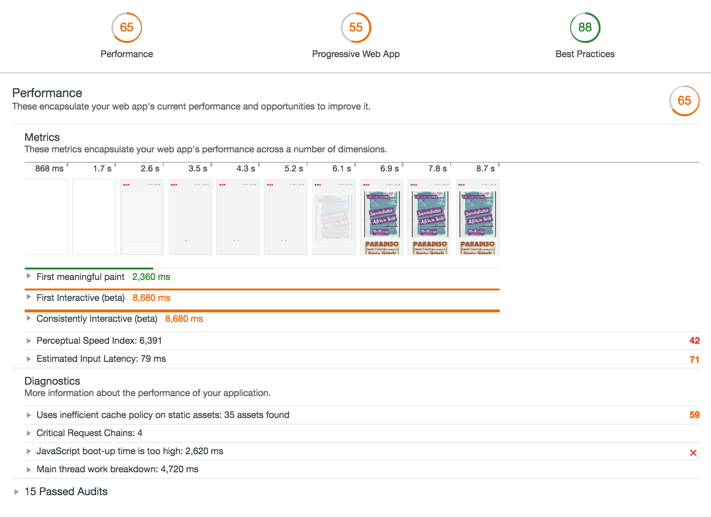
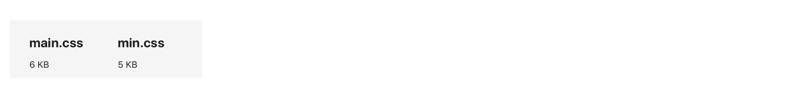
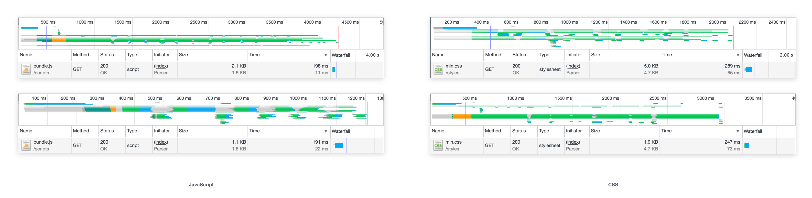

# Posters van Amsterdam server side


De client side versie van de Posters app heb ik omgezet naar een server side versie. De core functionaliteit van de app is om posters uit de geschiedenis van Amsterdam op te halen via Adamnet en hier details van te bekijken. Dit heb ik met Node.js opgelost.


## Installatie 
Dit project maakt gebruik van [Node.js](https://nodejs.org/en/) en NPM. 

**1. Clone repository**

```
git clone https://github.com/viennam/performance-matters-server-side.git
```

**2. Installeer dependencies**
```
npm install
```

**3. Start de server**
``` 
npm start 
```

**4. Open de app**

Ga in je browser naar `127.0.0.1:8000`

## Optimalisatie

Met behulp van  [Google Lighthouse audits](https://developers.google.com/web/tools/lighthouse/) heb ik het project geoptimaliseerd. Het doel is om de laadtijd te versnellen.

### Audit 1: Eindpunt client side SPA

De laadtijd van de client side SPA is 18000ms.

### Audit 2: Startpunt server side SPA

Kansen uit de eerste audit van de server side app die ik zou kunnen benutten zijn:
- Reduce render-blocking stylesheets
- Enable text compression
- Unused CSS rules
- Minify CSS

### Audit 3: Critical CSS 

Ik heb critical CSS toegevoegd om te voorkomen dat er HTML laadt voordat er CSS beschikbaar is, met de volgende code:

```
<link href="/styles/min.css" rel="preload" onload="this.rel='stylesheet'" as="style">
<noscript>
  <link rel="stylesheet" href="/styles/min.css">
</noscript>
<style>Belangrijkste inline CSS...</style>
```

### Audit 4: Minify & Gzip

#### Minify
Met behulp van uglifycss heb ik het CSS bestand verkleind, met deze code in `package.json`:
```
"uglify": "browserify public/scripts/index.js | uglifyjs > public/scripts/bundle.js && uglifycss public/styles/main.css > public/styles/min.css"
```


#### Gzip
Javascript en CSS heb ik vervolgens laten compressen met Gzip. Javascript is 1KB  en CSS 3KB kleiner dankzij compressie met Gzip.


## Conclusie

| App versie | Laadtijd (s) | 
| ------------- |-------------:| 
| Client Side eindpunt| `25.4` |    
| Server Side beginpunt| `7.7` |       
| Server Side eindpunt | `1.5` |        


## To do 
- [ ] Favorieten opslaan
- [ ] Dialog openen per poster
- [ ] Filter functies overnemen uit client side versie

